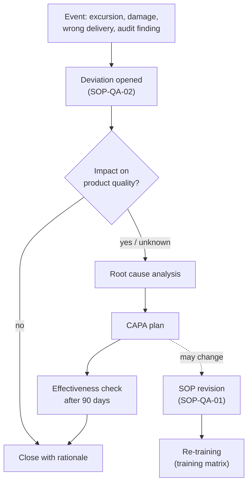

# Quality management system – overview

## Document hierarchy

1. Quality manual (not in this repository)
2. SOPs – `sops/`
3. Templates and forms – `templates/`
4. Records – `registers/`, `validation/`, `audits/`
